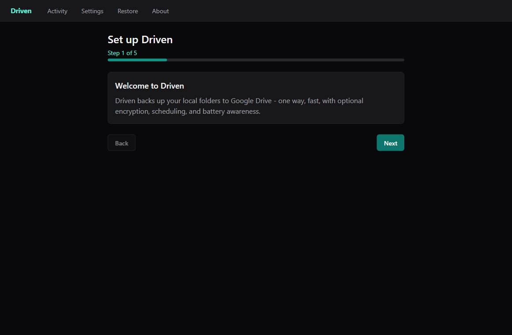
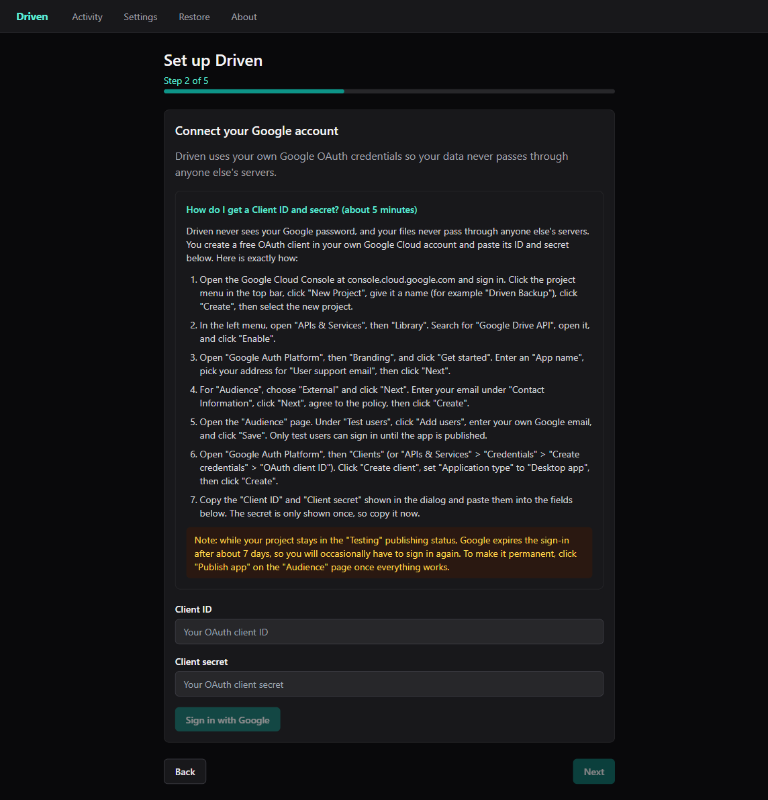

# Driven

One-way, encrypted backup of your local folders to your own Google Drive. Fast,
battery- and network-aware, with an in-app restore browser. Desktop app for
Windows, macOS, and Linux, built with Tauri 2 + Vue 3 + Rust.

Driven mirrors the folders you choose into your own Google Drive in one
direction only: local additions and changes are uploaded, and your source
folders stay the single source of truth. With per-source client-side encryption
turned on, file names and contents are encrypted on your machine before they
ever leave it, so Google stores only ciphertext.



Driven uses your own Google OAuth credentials, so your files never pass through
anyone else's servers. The first-run wizard includes a step-by-step, plain-English
guide to creating that credential in the Google Cloud Console:



## How Driven compares

Driven's niche is a native, cross-platform desktop app that pairs end-to-end
encryption with one-way backup to a cloud you already own, plus developer- and
laptop-friendly touches (gitignore-aware excludes, battery / metered-network
awareness) that the CLI backup tools and consumer cloud clients skip. Where
Driven is thinner today (extra storage backends, block-level dedup) is called
out honestly below.

| Capability | Driven | rclone | Drive for desktop | Duplicati | restic | Backblaze |
| --- | --- | --- | --- | --- | --- | --- |
| One-way backup, source stays the source of truth | Yes | Partial [1] | No [2] | Yes | Yes | Yes |
| End-to-end (client-side) encryption | Yes | Yes | No [3] | Yes | Yes | Partial [4] |
| Backs up to storage you own / control | Yes | Yes | Yes | Yes | Yes | No [5] |
| No account with the tool's vendor, no vendor servers | Yes | Yes | No | Yes | Yes | No |
| Choice of multiple storage backends | No [6] | Yes | No | Yes | Yes | No |
| Point-in-time restore (an earlier version by date) | Yes | No | Partial [7] | Yes | Yes | Yes [8] |
| Block-level deduplication | No [6] | No | No | Yes | Yes | No |
| Locked / open-file backup (Windows VSS) | Yes | No | Partial [9] | Yes | Yes | Yes |
| Automatic battery / metered-network / sleep awareness | Yes | No | No | No | No | No [10] |
| Per-source include/exclude incl. .gitignore | Yes | Partial [11] | No | Partial [11] | Partial [11] | Partial [11] |
| Native desktop GUI app | Yes | No [12] | Yes | Partial [13] | No [12] | Yes |
| In-app file search + selective restore | Yes | No | Yes | Yes | Partial [14] | Yes |
| Open source (permissive license) | Yes | Yes | No | Yes | Yes | No |
| Cross-platform desktop (Windows, macOS, Linux) | Yes | Yes | No [15] | Yes | Yes | No [15] |

Notes:

1. rclone is a general-purpose sync/copy engine (including two-way `bisync`); backup direction is whatever you script.
2. Drive for desktop is a two-way sync client, not a one-way backup.
3. Drive uses server-side encryption; client-side encryption exists only for eligible Google Workspace accounts an admin configures, not consumer accounts.
4. Backblaze defaults to provider-managed keys; a user-set private key is optional, and its passphrase is entered on Backblaze's servers during a web restore.
5. Backblaze Personal Backup targets Backblaze's own cloud, not storage you supply.
6. Google Drive is Driven's only backend today; additional backends and block-level dedup are on the post-v1 backlog ([issue #34](https://github.com/pmaxhogan/driven/issues/34)), not shipped.
7. Google Drive keeps a limited recent version history; it is not a configurable point-in-time backup.
8. Backblaze restores from within a retention window (30 days by default, extendable).
9. Drive for desktop continuously syncs open files but does not take an application-consistent VSS snapshot.
10. Several tools offer manual bandwidth limits or schedules; only Driven automatically defers on battery, metered, or offline networks and resumes on wake.
11. rclone, Duplicati, restic, and Backblaze support custom include/exclude filter rules but not `.gitignore` semantics.
12. rclone and restic are command-line tools; their GUIs are separate third-party projects (for example RcloneView, Backrest).
13. Duplicati runs as a background service with a local web UI plus a tray helper, not a native desktop app.
14. restic search and selective restore are driven from the CLI (or a mounted snapshot), not an in-app browser.
15. Windows and macOS only; Linux needs third-party tools.

Feature sets verified 2026-07; check each project's current docs before relying on a cell.

## Features

- One-way backup to your own Google Drive (no second cloud bill, no two-way
  sync surprises).
- Optional per-source client-side encryption (XChaCha20-Poly1305 for contents
  and file names; a BIP39 recovery phrase guards the master key).
- Scanner that honors `.gitignore`, built-in and custom exclude rules, and a
  configurable symlink policy.
- Concurrent, paced executor with retries and resumable uploads.
- Battery and network awareness: backups defer on battery and on metered or
  offline networks, then resume automatically.
- Windows Volume Shadow Copy support so locked files (Outlook PSTs, running DB
  files, VM disks) still back up.
- In-app restore browser with full-text file-name search and streaming decrypt.
- Activity dashboard with a live tail and filterable history.
- In-app auto-update with signed update manifests and a stable / dev channel
  selector.
- Anonymous, opt-out telemetry (coarse counts only; never file names, paths, or
  content).

## Install

Download the installer for your platform from the
[GitHub Releases page](https://github.com/pmaxhogan/driven/releases). Pick the
latest release and grab the asset for your OS:

- Windows: `.msi` or `.exe` (NSIS) installer
- macOS: `.dmg` (universal, Apple Silicon and Intel)
- Linux: `.AppImage` (portable) or `.deb` (Debian / Ubuntu)

### Unsigned-binary notes (important)

Driven's V1 binaries are not yet code-signed with a paid OS certificate, so the
operating system will warn you the first time you run them. The binaries are the
same artifacts the public CI release pipeline produced; the warnings are about
the missing certificate, not about the contents. You bypass them once.

#### Windows (SmartScreen)

When you run the installer, Windows SmartScreen may show "Windows protected your
PC". Click "More info", then "Run anyway". After the first install, SmartScreen
stops warning for that version.

#### macOS (Gatekeeper)

macOS will refuse to open an unsigned app on a double-click. Either:

- Right-click (or Control-click) the app in Finder, choose "Open", then confirm
  "Open" in the dialog, or
- Remove the quarantine attribute from a terminal:

  ```sh
  xattr -dr com.apple.quarantine "/Applications/Driven.app"
  ```

#### macOS auto-updater caveat (V1)

Because the macOS build is not signed with a Developer ID in V1, the in-app
auto-updater is NOT reliable on macOS: the OS may block the silently-staged
update from launching. This is a known V1 limitation. On macOS, update Driven by
re-downloading the latest `.dmg` from the Releases page and reinstalling, rather
than relying on the in-app updater. On Windows and Linux the in-app updater works
normally. Code signing on macOS is tracked for a future release, after which the
in-app updater will be supported there too.

## First run: connect Google Drive (bring your own OAuth credentials)

Driven uses YOUR own Google OAuth client credentials rather than a shared
app-wide client. This keeps you in control of your Google project and avoids a
shared rate-limit / verification bottleneck. On first launch, the setup wizard
walks you through:

1. Creating (or reusing) a Google Cloud project and enabling the Google Drive
   API.
2. Creating an OAuth 2.0 Client ID of type "Desktop app" and pasting its client
   id and client secret into the wizard. Driven uses the PKCE loopback flow, so
   the secret stays on your machine; refresh tokens are stored only in the OS
   keychain.
3. Signing in to the Google account you want to back up to and granting Drive
   access.
4. Choosing the folders to back up and (optionally) enabling encryption, which
   generates and shows your recovery phrase. Write the recovery phrase down: it
   is the only way to decrypt your backup if you lose the machine.

The wizard explains each step in-app. If you skip a step you can finish it later
from Settings.

## Update channels

Driven has two update channels, selectable in Settings > About:

- Stable: tagged releases (recommended for everyone).
- Dev: pre-release builds for testing upcoming changes; expect rough edges.

The About screen shows the current version, the active channel, and the release
notes for the installed version (sourced from `CHANGELOG.md`). See the macOS
updater caveat above before relying on in-app updates on macOS.

## Build from source

Prereqs:

- Rust stable (`rustup install stable`)
- Node.js 22+ and pnpm 10+
- `cargo install tauri-cli@^2 cargo-deny cargo-watch just`
  (Windows users can install `just` via `scoop install just`)
- Linux build deps: `libwebkit2gtk-4.1-dev libxdo-dev libssl-dev`
  `libayatana-appindicator3-dev librsvg2-dev libsoup-3.0-dev`
  `javascriptcoregtk-4.1`

Clone and run in dev mode:

```sh
git clone https://github.com/pmaxhogan/driven
cd driven
pnpm --dir ui install
cargo tauri dev
```

Produce installers (output under `src-tauri/target/release/bundle/`):

```sh
cargo tauri build
```

Useful recipes (see the `justfile`):

```sh
just test    # cargo test --workspace + vitest
just lint    # cargo fmt --check + clippy + eslint
just bundle  # cargo tauri build
just deny    # cargo deny check
```

## Run via Docker

The headless tools - the debugging CLI (`driven-cli`) and the stress / chaos
harness (`driven-chaos`) - ship as a public image at
`ghcr.io/pmaxhogan/driven`. The image does **not** include the desktop GUI; use
the native installers above for that.

Tags:

- `:latest` / `:stable` - the highest stable release.
- `:dev` / `:nightly` - the latest `main` commit.
- `:vX.Y.Z` - an exact release; `:vX` - the highest stable build of major `X`.

```sh
# Default (no args) prints the CLI help:
docker run --rm ghcr.io/pmaxhogan/driven

# Run the CLI as normal:
docker run --rm ghcr.io/pmaxhogan/driven driven-cli --help

# Run the long chaos soak (issue #23) - the hermetic sweep then a seeded fuzz:
docker run --rm ghcr.io/pmaxhogan/driven:dev chaos-soak --duration 6h

# Or invoke the chaos harness directly:
docker run --rm ghcr.io/pmaxhogan/driven driven-chaos fuzz --duration 6h
```

## Design docs

- `design/DESIGN.md` - architecture, locked decisions, resolved defaults
- `design/SPEC.md` - concrete crate / schema / IPC / config detail
- `design/ROADMAP.md` - M0..M10 phased milestones
- `design/STRESS_HARNESS.md` - chaos / fuzz / soak test catalogue
- `design/IMPLEMENTATION.md` - implementation orchestration plan

## Contributing

See [CONTRIBUTING.md](CONTRIBUTING.md) for the local gates, the Conventional
Commits requirement, and the branch / PR flow, and
[CODE_OF_CONDUCT.md](CODE_OF_CONDUCT.md) for community expectations.

## License

Dual-licensed under either of:

- MIT license ([LICENSE-MIT](LICENSE-MIT))
- Apache License, Version 2.0 ([LICENSE-APACHE](LICENSE-APACHE))

at your option. See [LICENSE](LICENSE) for the summary and SPDX identifier.

Contributions intentionally submitted for inclusion in Driven by you, as defined
in the Apache-2.0 license, shall be dual-licensed as above, without any
additional terms or conditions.
