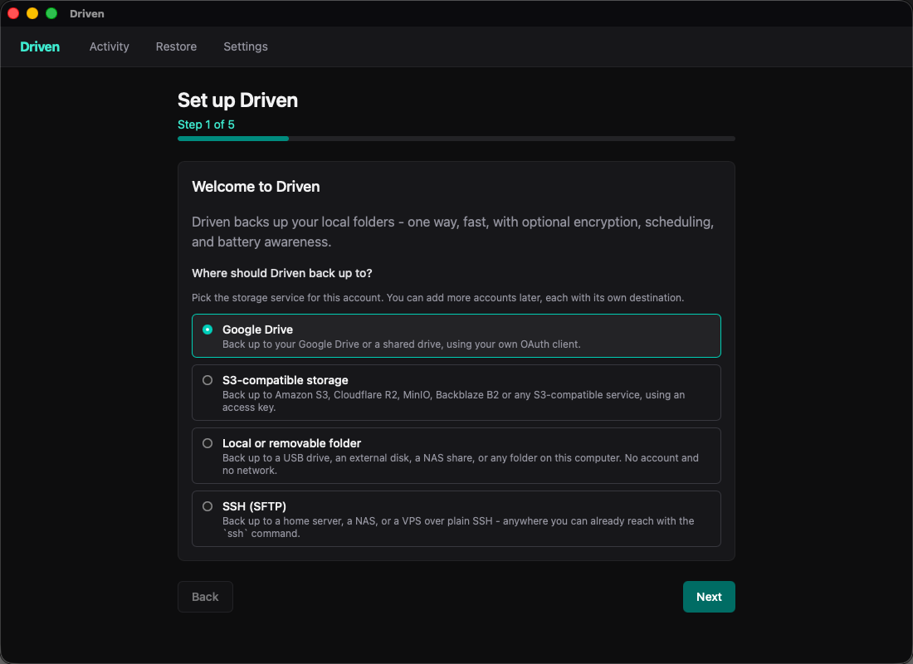
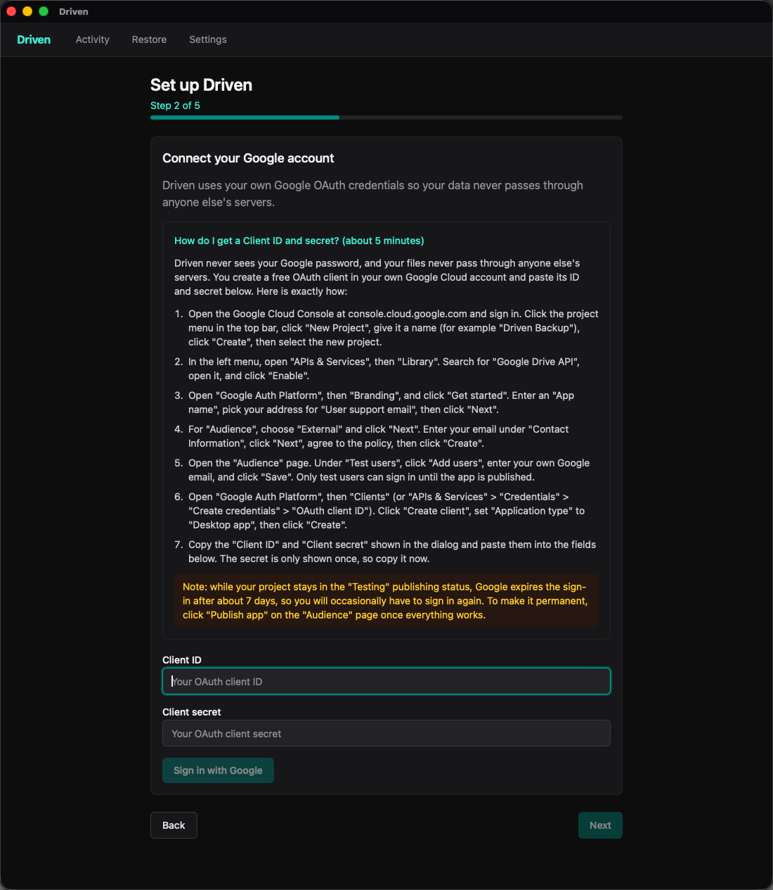

# Driven

One-way, encrypted backup of your local folders to your own Google Drive. Fast,
battery- and network-aware, with an in-app restore browser. Desktop app for
Windows, macOS, and Linux, built with Tauri 2 + Vue 3 + Rust.

Driven mirrors the folders you choose into your own Google Drive in one
direction only: local additions and changes are uploaded, and your source
folders stay the single source of truth. With per-source client-side encryption
turned on, file names and contents are encrypted on your machine before they
ever leave it, so Google stores only ciphertext.



Driven uses your own Google OAuth credentials, so your files never pass through
anyone else's servers. The first-run wizard includes a step-by-step, plain-English
guide to creating that credential in the Google Cloud Console:



## How Driven compares

Driven is a native desktop app that pairs end-to-end encryption with one-way
backup to a cloud you already own, plus laptop-friendly touches - gitignore-aware
excludes, battery and metered-network awareness, and backup work that runs below
normal CPU and disk priority so it does not fight whatever you are actually using
the machine for - that CLI backup tools and consumer sync clients skip. Where it
is thinner today (more backends, block-level dedup) is marked honestly below.

Legend: :white_check_mark: yes &nbsp; :large_orange_diamond: partial (see note) &nbsp; :x: no &nbsp; :grey_question: not documented

| Capability | Driven | rclone | Drive for desktop | Duplicati | restic | Backblaze |
| --- | :---: | :---: | :---: | :---: | :---: | :---: |
| One-way backup, source stays the source of truth | :white_check_mark: | :large_orange_diamond:¹ | :x:² | :white_check_mark: | :white_check_mark: | :white_check_mark: |
| Automatic background sync (file-change watcher) | :white_check_mark: | :x:³ | :white_check_mark: | :x:³ | :x:³ | :white_check_mark: |
| Resumable, crash-safe transfers | :white_check_mark: | :large_orange_diamond:⁴ | :white_check_mark: | :white_check_mark: | :white_check_mark: | :white_check_mark: |
| Backs up to storage you own / control | :white_check_mark: | :white_check_mark: | :white_check_mark: | :white_check_mark: | :white_check_mark: | :x:⁵ |
| No account with the tool's vendor, no vendor servers | :white_check_mark: | :white_check_mark: | :x: | :white_check_mark: | :white_check_mark: | :x: |
| Choice of multiple storage backends | :x:⁶ | :white_check_mark: | :x: | :white_check_mark: | :white_check_mark: | :x: |
| End-to-end (client-side) encryption | :white_check_mark: | :white_check_mark: | :x:⁷ | :white_check_mark: | :white_check_mark: | :large_orange_diamond:⁸ |
| Encrypted file names, not just contents | :white_check_mark: | :white_check_mark: | :x: | :white_check_mark: | :white_check_mark: | :x: |
| Recovery phrase for the encryption key | :white_check_mark: | :x:⁹ | :x: | :x:⁹ | :x:⁹ | :x:⁹ |
| Point-in-time restore (an earlier version by date) | :white_check_mark: | :x: | :large_orange_diamond:¹⁰ | :white_check_mark: | :white_check_mark: | :white_check_mark:¹¹ |
| Block-level deduplication | :x:⁶ | :x: | :x: | :white_check_mark: | :white_check_mark: | :x: |
| Locked / open-file backup (Windows VSS)⁴¹ | :white_check_mark: | :x: | :large_orange_diamond:¹² | :white_check_mark: | :white_check_mark: | :white_check_mark: |
| Periodic integrity re-verification | :white_check_mark: | :large_orange_diamond:¹³ | :x: | :white_check_mark: | :large_orange_diamond:¹³ | :large_orange_diamond:¹³ |
| Re-uploads backup copies deleted at the destination | :white_check_mark:¹⁴ | :white_check_mark:¹⁵ | :x:¹⁶ | :large_orange_diamond:¹⁷ | :large_orange_diamond:¹⁷ | :grey_question:¹⁸ |
| Parallel, multi-threaded local scan | :white_check_mark:¹⁹ | :white_check_mark:²⁰ | :grey_question:²¹ | :x:²² | :large_orange_diamond:²³ | :grey_question:²¹ |
| OS-level CPU / disk I/O priority for backup work | :white_check_mark:²⁴ | :x:²⁵ | :x:²⁵ | :x:²⁵ | :x:²⁵ | :x:²⁵ |
| Automatic battery / metered-network / sleep awareness | :white_check_mark: | :x: | :x: | :x: | :x: | :x:²⁶ |
| Per-source include/exclude incl. .gitignore | :white_check_mark: | :large_orange_diamond:²⁷ | :x:²⁷ | :large_orange_diamond:²⁷ | :large_orange_diamond:²⁷ | :large_orange_diamond:²⁷ |
| Live preview of which files a rule keeps or drops | :white_check_mark:²⁸ | :large_orange_diamond:²⁹ | :x: | :white_check_mark:³⁰ | :large_orange_diamond:²⁹ | :x: |
| Native desktop GUI app | :white_check_mark: | :x:³¹ | :white_check_mark: | :large_orange_diamond:³² | :x:³¹ | :white_check_mark: |
| In-app file search + selective restore | :white_check_mark: | :x: | :white_check_mark: | :white_check_mark: | :large_orange_diamond:³³ | :white_check_mark: |
| Rolling local logs plus a one-click diagnostics bundle | :white_check_mark:³⁴ | :large_orange_diamond:³⁵ | :white_check_mark: | :large_orange_diamond:³⁶ | :x:³⁷ | :white_check_mark: |
| Open source (permissive license) | :white_check_mark: | :white_check_mark: | :x: | :white_check_mark: | :white_check_mark: | :x: |
| Cross-platform desktop (Windows, macOS, Linux) | :white_check_mark: | :white_check_mark: | :x:³⁸ | :white_check_mark: | :white_check_mark: | :x:³⁸ |
| Reproducible end-to-end benchmark suite in the repo | :white_check_mark:³⁹ | :x:⁴⁰ | :x:⁴⁰ | :x:⁴⁰ | :x:⁴⁰ | :x:⁴⁰ |

Notes:

- ¹ rclone is a general-purpose sync/copy engine (including two-way `bisync`); backup direction is whatever you script.
- ² Drive for desktop is a two-way sync client, not a one-way backup.
- ³ rclone, restic, and Duplicati back up on a schedule (cron / systemd / built-in scheduler), not from a live file-change watcher.
- ⁴ rclone resumes at file granularity on re-run; mid-file resume of a large object depends on the backend.
- ⁵ Backblaze Personal Backup targets Backblaze's own cloud, not storage you supply.
- ⁶ Google Drive is Driven's only backend today; additional backends and block-level dedup are on the post-v1 backlog ([issue #34](https://github.com/pmaxhogan/driven/issues/34)), not shipped.
- ⁷ Drive uses server-side encryption; client-side encryption exists only for eligible Google Workspace accounts an admin configures, not consumer accounts.
- ⁸ Backblaze defaults to provider-managed keys; a user-set private key is optional, and its passphrase is entered on Backblaze's servers during a web restore.
- ⁹ These tools protect the key with a passphrase you must remember; only Driven generates a BIP39 recovery phrase you can write down to recover the key.
- ¹⁰ Google Drive keeps a limited recent version history; it is not a configurable point-in-time backup.
- ¹¹ Backblaze restores from within a retention window (30 days by default, extendable).
- ¹² Drive for desktop continuously syncs open files but does not take an application-consistent VSS snapshot.
- ¹³ rclone (`check` / `cryptcheck`) and restic (`check`) verify on demand rather than on an automatic schedule; Backblaze runs periodic server-side checks only.
- ¹⁴ Driven keeps a local state database, so an unchanged file is not normally re-checked against the cloud at all. A separate audit pass therefore runs at startup and on every deep-verify cycle: it enumerates what the account still holds for each source and re-queues anything whose remote object is gone. It infers "missing" only from an enumeration it completed, so a failed listing heals nothing rather than re-uploading a whole source.
- ¹⁵ rclone keeps no state, so `copy` / `sync` re-list the destination on every run and a file deleted there is simply transferred again. Self-correcting by construction, at the cost of a full remote listing every run.
- ¹⁶ Worse than absent: Drive for desktop mirrors deletions in both directions, so a file deleted in Drive is deleted locally too.
- ¹⁷ Both detect destination damage (`list-broken-files`, `check`), but recovery is operator-driven. Duplicati's `repair` regenerates index files, while missing data volumes need `--rebuild-missing-dblock-files` or get amputated by `purge-broken-files`; restic's `repair` commands drop references to lost data, and healing means re-running `backup` against a source that still has it.
- ¹⁸ Backblaze does not document whether its client detects and re-uploads files whose server-side copies were lost.
- ¹⁹ Driven's walk runs on `available_parallelism()` worker threads (clamped to 2..=8) off the async runtime, and prunes excluded directories that no negation rule can reach into rather than descending them.
- ²⁰ rclone walks at `--checkers` concurrency (8 by default) and transfers at `--transfers` (4 by default).
- ²¹ Neither Google nor Backblaze documents its client's scan concurrency. Backblaze's thread setting governs upload connections, not the local walk.
- ²² Duplicati's file enumeration is a single serial pass; the hashing, compression, and upload stages downstream of it are concurrent.
- ²³ restic reads files concurrently at `--read-concurrency`, which defaults to 2.
- ²⁴ Driven's `io_priority` setting (`low` by default) maps to real per-platform OS calls: below-normal thread priority plus per-handle I/O priority hints on Windows, `ioprio_set` on Linux, `setiopolicy_np` on macOS. It shapes the scan walk, upload reads, and bundle builds. It is best-effort by design, so a refused call means that work runs at normal priority rather than failing.
- ²⁵ None of the five sets an OS priority itself. rclone and restic document running them under `nice` / `ionice` yourself; Duplicati still accepts `--thread-priority` but marks it deprecated ("has no effect, use the operating system controls to set the process priority"); Drive for desktop and Backblaze offer bandwidth throttles (and Backblaze an upload-thread count), which cap network rate rather than CPU or disk priority.
- ²⁶ Several tools offer manual bandwidth limits or schedules; only Driven automatically defers on battery, metered, or offline networks and resumes on wake.
- ²⁷ rclone, Duplicati, restic, and Backblaze support custom include/exclude filter rules but not `.gitignore` semantics. Drive for desktop has no pattern rules at all, only a choice of which folders to sync.
- ²⁸ Driven re-classifies the folder tree from an in-memory cache as you type, so a rule edit updates the tree and its counts without re-reading the disk. On a 63k-entry tree a re-classification takes 536 ms against 868 ms for a fresh walk of the same (already OS-cached) tree, and issues no `read_dir` calls at all, so unlike a walk its cost does not scale with disk speed.
- ²⁹ rclone and restic answer the question with `--dry-run`, which re-walks the source on every attempt.
- ³⁰ Duplicati 2.3.0.4 (July 2026) added server-evaluated inclusion state to its new UI's tree; it marks the nodes you expand rather than summarising the whole source.
- ³¹ rclone and restic are command-line tools; their GUIs are separate third-party projects (for example RcloneView, Backrest).
- ³² Duplicati runs as a background service with a local web UI plus a tray helper, not a native desktop app.
- ³³ restic search and selective restore are driven from the CLI (or a mounted snapshot), not an in-app browser.
- ³⁴ Driven writes daily rolling logs (pruned at 14 days / 25 MB) that interleave backend tracing with the webview's own console output, and the in-app diagnostics export bundles them.
- ³⁵ rclone logs to a file only when you pass `--log-file` (rotation via `--log-file-max-size` and friends), and has no bundle export; its bug template asks you to attach a log you produced by hand.
- ³⁶ Duplicati's "Create bug report" export is a genuine one-click bundle (system info plus an obfuscated copy of the local database), and its web UI has a live log view; file logging is opt-in via `--log-file`, defaults to warnings only, and does not rotate.
- ³⁷ restic has no log-file option at all - output goes to stdout, and the only file logging is an unrotated `DEBUG_LOG` env var that its contributing guide asks you to redact yourself.
- ³⁸ Windows and macOS only; Linux needs third-party tools.
- ³⁹ `bench/` runs Driven's real engine and rclone over identical seeded fixtures against a live Drive account, reporting wall time, throughput, API calls, CPU time, and peak memory for a cold and an incremental pass. See [`bench/README.md`](bench/README.md) for scales, costs, and what is and is not apples-to-apples.
- ⁴⁰ The others publish unit-test microbenchmarks, internal tuning harnesses (Duplicati's unreleased AutoTune), or vendor marketing numbers, rather than a runnable end-to-end suite. Backblaze does publish a quarterly benchmark, but of B2 object storage rather than the backup client.
- ⁴¹ Driven's checkmark is scoped to Windows, where a VSS snapshot lets a locked file (Outlook PST, running DB, VM disk) back up while it is held open. Neither macOS nor Linux backs a file up through a lock today - on macOS and Linux, a file Driven cannot open is instead classified precisely as a transient lock (`local.file_locked`) versus a macOS Full Disk Access denial (`local.permission_denied`) and skipped with a clear reason in the activity log, rather than misreported as a disk error. A macOS APFS-snapshot bypass equivalent to Windows VSS exists as a broker crate but is not yet wired into the backup path, so it does not do anything for a user yet; there is no Linux equivalent planned. See `design/DESIGN.md` §5.3 and §5.3.2.

Competitor rows were verified in July 2026 against rclone 1.74.4, restic 0.19.1,
Duplicati 2.3.0.4, Backblaze Personal Backup 10.0.2, and Drive for desktop 128.0.
These move: check each project's current docs before relying on a cell.

## Features

- One-way backup to your own Google Drive (no second cloud bill, no two-way
  sync surprises).
- Optional per-source client-side encryption (XChaCha20-Poly1305 for contents
  and file names; a BIP39 recovery phrase guards the master key).
- Parallel, multi-threaded scanner that honors `.gitignore`, built-in and custom
  exclude rules, and a configurable symlink policy, and that skips excluded
  directories instead of descending them.
- Live exclusion preview that re-classifies the folder tree as you edit a rule,
  from an in-memory tree rather than a fresh walk of the disk.
- Concurrent, paced executor with retries and resumable uploads.
- Configurable OS priority (`low` by default) for the scan, upload reads, and
  bundle builds, so backups yield CPU and disk to whatever is in the foreground.
- Battery and network awareness: backups defer on battery and on metered or
  offline networks, then resume automatically.
- Remote-existence audit that re-queues files whose Drive copies were deleted
  outside Driven, so a destination-side deletion cannot leave a file silently
  un-backed-up.
- Windows Volume Shadow Copy support so locked files (Outlook PSTs, running DB
  files, VM disks) still back up. On macOS and Linux, a file Driven cannot open
  is classified precisely - a transient lock versus a macOS Full Disk Access
  denial - and skipped with a clear reason rather than reported as a generic
  disk error; an APFS-snapshot bypass equivalent to Windows VSS is in
  development for macOS but not yet available.
- In-app restore browser with full-text file-name search and streaming decrypt.
- Activity dashboard with a live tail and filterable history.
- Rolling local log files covering both the backend and the webview console,
  collected into a one-click diagnostics bundle.
- In-app auto-update with signed update manifests and a stable / dev channel
  selector.
- Anonymous, opt-out telemetry (coarse counts only; never file names, paths, or
  content).

<!--
DRAFT - do not uncomment until the corresponding PR merges. Flip each bullet
on individually as its PR lands, then delete this comment wrapper.
- S3-compatible backup destination, in addition to Google Drive. (#207,
  unmerged - depends on the pluggable-backend seam / `driven-remote` crate,
  #200, also unmerged.)
- Local / removable-drive backup destination. (unmerged - same seam as above.)
- Guided Full Disk Access onboarding for macOS, so Driven walks you through
  granting access to Mail / Messages / Photos instead of requiring a manual
  System Settings visit. (#205, unmerged.)
- Scheduled integrity scrub that periodically re-verifies already-backed-up
  files against the destination. (unmerged.)
- Restore drill: a one-click "prove the backup actually restores" check.
  (unmerged.)
- rclone config importer: point Driven at an existing rclone config to
  pre-fill setup. (unmerged.)
-->

## Install

Download the installer for your platform from the
[GitHub Releases page](https://github.com/pmaxhogan/driven/releases). Pick the
latest release and grab the asset for your OS:

- Windows: `.msi` or `.exe` (NSIS) installer
- macOS: `.dmg` (universal, Apple Silicon and Intel)
- Linux: `.AppImage` (portable) or `.deb` (Debian / Ubuntu)

### Unsigned-binary notes (important)

Driven's V1 binaries are not yet code-signed with a paid OS certificate, so the
operating system will warn you the first time you run them. The binaries are the
same artifacts the public CI release pipeline produced; the warnings are about
the missing certificate, not about the contents. You bypass them once.

#### Windows (SmartScreen)

When you run the installer, Windows SmartScreen may show "Windows protected your
PC". Click "More info", then "Run anyway". After the first install, SmartScreen
stops warning for that version.

#### macOS (Gatekeeper)

macOS will refuse to open an unsigned app on a double-click. Either:

- Right-click (or Control-click) the app in Finder, choose "Open", then confirm
  "Open" in the dialog, or
- Remove the quarantine attribute from a terminal:

  ```sh
  xattr -dr com.apple.quarantine "/Applications/Driven.app"
  ```

#### macOS Full Disk Access (separate from Gatekeeper)

Opening the app (above) and reading protected data are two different macOS
permissions, and one does not grant the other. macOS's privacy layer (TCC)
blocks access to `~/Library/Mail`, `~/Library/Messages`, Photos, and similar
locations no matter what the file's permission bits say, until you grant
Driven **Full Disk Access** in System Settings > Privacy & Security > Full
Disk Access. A file in that state fails to open with a permission error, not a
"file is busy" error, and Driven reports it in the activity log rather than
silently skipping it or silently backing it up.

There is currently no in-app guided flow for granting Full Disk Access - that
is planned for a future release. Until then, grant it manually if you want
those folders backed up; everything else backs up normally without it.

**A locked-file snapshot is not a substitute for Full Disk Access, and Driven
never tries to make it one.** Driven's locked-file handling (Windows VSS
today; a macOS APFS-snapshot equivalent is in development, see the table
above) exists to read around a file that is transiently *busy* - open in
another program. It does not and cannot read around a TCC *denial*, because a
snapshot preserves the original file's permissions and is itself subject to
the same TCC check. The historical `-o noowners` mount trick that could bypass
this (CVE-2020-9771) is long patched and is now a signature EDR products flag
as suspicious; Driven does not use it and never will.

#### macOS auto-updater caveat

Because the macOS build is not signed with a Developer ID, the in-app
auto-updater is NOT reliable on macOS: the OS may block the silently-staged
update from launching. This is a known limitation - unrelated to hardware
access (the macOS-specific work in this release, including the locked-file
classification and the tray icon, was verified on real Apple Silicon
hardware) and purely about the unresolved cost/process of Developer ID
enrollment. On macOS, update Driven by
re-downloading the latest `.dmg` from the Releases page and reinstalling, rather
than relying on the in-app updater. On Windows and Linux the in-app updater works
normally. Code signing on macOS is tracked for a future release, after which the
in-app updater will be supported there too.

## First run: connect Google Drive (bring your own OAuth credentials)

Driven uses YOUR own Google OAuth client credentials rather than a shared
app-wide client. This keeps you in control of your Google project and avoids a
shared rate-limit / verification bottleneck. On first launch, the setup wizard
walks you through:

1. Creating (or reusing) a Google Cloud project and enabling the Google Drive
   API.
2. Creating an OAuth 2.0 Client ID of type "Desktop app" and pasting its client
   id and client secret into the wizard. Driven uses the PKCE loopback flow, so
   the secret stays on your machine; refresh tokens are stored only in the OS
   keychain.
3. Signing in to the Google account you want to back up to and granting Drive
   access.
4. Choosing the folders to back up and (optionally) enabling encryption, which
   generates and shows your recovery phrase. Write the recovery phrase down: it
   is the only way to decrypt your backup if you lose the machine.

The wizard explains each step in-app. If you skip a step you can finish it later
from Settings.

## Migrating from rclone

Already have an `rclone.conf`? `driven-cli` reads it and tells you exactly what
to enter, rather than making you re-type every endpoint and key:

```sh
driven-cli rclone list                      # every remote, and what it maps to
driven-cli rclone import r2 --bucket backups   # the settings for one remote
```

It finds the config in the same places rclone does (override with `--config`;
`rclone config file` prints the one rclone is using). What transfers:

- **`type = s3`** (AWS, Cloudflare R2, MinIO, Wasabi, Ceph, B2-over-S3, ...) -
  endpoint, region and addressing style, plus the access key pair. The AWS
  regional endpoint is derived from the region when rclone left it blank, and a
  scheme-less endpoint gains `https://`. The one thing that cannot come from the
  file is the **bucket**: rclone puts it in the path you type
  (`remote:mybucket/dir`), not in the config, so pass `--bucket`.
- **`type = drive`** - the destination folder id and Shared Drive id. The OAuth
  token **cannot** transfer: a refresh token is redeemable only by the OAuth
  client it was issued to (RFC 6749 s6), and rclone's grant was issued to
  rclone's client. Sign in to Driven once and the grant is yours.

The command is read-only - it creates no account and stores no secret. The
secret access key prints as `<redacted>` unless you pass `--reveal-secrets`, and
the Drive OAuth token is never printed at all. A password-encrypted
`rclone.conf` is detected and refused with instructions (`rclone config show`)
rather than prompting you for your rclone password.

## Update channels

Driven has two update channels, selectable in Settings > About:

- Stable: tagged releases (recommended for everyone).
- Dev: pre-release builds for testing upcoming changes; expect rough edges.

The About screen shows the current version, the active channel, and the release
notes for the installed version (sourced from `CHANGELOG.md`). See the macOS
updater caveat above before relying on in-app updates on macOS.

## Build from source

Prereqs:

- Rust stable (`rustup install stable`)
- Node.js 22+ and pnpm 10+
- `cargo install tauri-cli@^2 cargo-deny cargo-watch just`
  (Windows users can install `just` via `scoop install just`)
- Linux build deps: `libwebkit2gtk-4.1-dev libxdo-dev libssl-dev`
  `libayatana-appindicator3-dev librsvg2-dev libsoup-3.0-dev`
  `javascriptcoregtk-4.1`

Clone and run in dev mode:

```sh
git clone https://github.com/pmaxhogan/driven
cd driven
pnpm --dir ui install
cargo tauri dev
```

Produce installers (output under `src-tauri/target/release/bundle/`):

```sh
cargo tauri build
```

Useful recipes (see the `justfile`):

```sh
just test    # cargo test --workspace + vitest
just lint    # cargo fmt --check + clippy + eslint
just bundle  # cargo tauri build
just deny    # cargo deny check
just bench   # benchmark the real engine against rclone (needs live credentials)
```

`just bench` uploads to a real Drive account and costs real bandwidth; read
[`bench/README.md`](bench/README.md) for the prerequisites, scales, and safety
rails before running it.

## Run via Docker

The headless tools - the debugging CLI (`driven-cli`) and the stress / chaos
harness (`driven-chaos`) - ship as a public image at
`ghcr.io/pmaxhogan/driven`. The image does **not** include the desktop GUI; use
the native installers above for that.

Tags:

- `:latest` / `:stable` - the highest stable release.
- `:dev` / `:nightly` - the latest `main` commit.
- `:vX.Y.Z` - an exact release; `:vX` - the highest stable build of major `X`.

```sh
# Default (no args) prints the CLI help:
docker run --rm ghcr.io/pmaxhogan/driven

# Run the CLI as normal:
docker run --rm ghcr.io/pmaxhogan/driven driven-cli --help

# Run the long chaos soak (issue #23) - the hermetic sweep then a seeded fuzz:
docker run --rm ghcr.io/pmaxhogan/driven:dev chaos-soak --duration 6h

# Or invoke the chaos harness directly:
docker run --rm ghcr.io/pmaxhogan/driven driven-chaos fuzz --duration 6h
```

## Design docs

- `design/DESIGN.md` - architecture, locked decisions, resolved defaults
- `design/SPEC.md` - concrete crate / schema / IPC / config detail
- `design/ROADMAP.md` - M0..M10 phased milestones
- `design/STRESS_HARNESS.md` - chaos / fuzz / soak test catalogue
- `design/IMPLEMENTATION.md` - implementation orchestration plan

## Contributing

See [CONTRIBUTING.md](CONTRIBUTING.md) for the local gates, the Conventional
Commits requirement, and the branch / PR flow, and
[CODE_OF_CONDUCT.md](CODE_OF_CONDUCT.md) for community expectations.

## License

Dual-licensed under either of:

- MIT license ([LICENSE-MIT](LICENSE-MIT))
- Apache License, Version 2.0 ([LICENSE-APACHE](LICENSE-APACHE))

at your option. See [LICENSE](LICENSE) for the summary and SPDX identifier.

Contributions intentionally submitted for inclusion in Driven by you, as defined
in the Apache-2.0 license, shall be dual-licensed as above, without any
additional terms or conditions.
